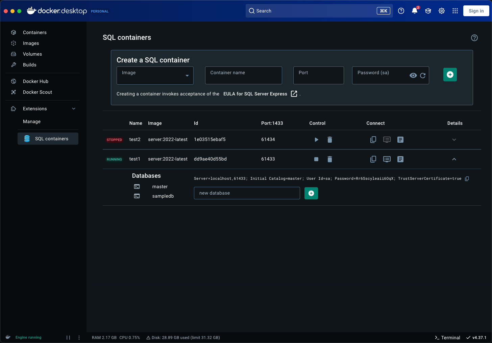
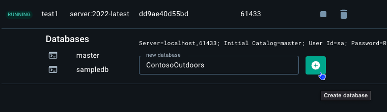
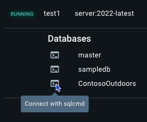
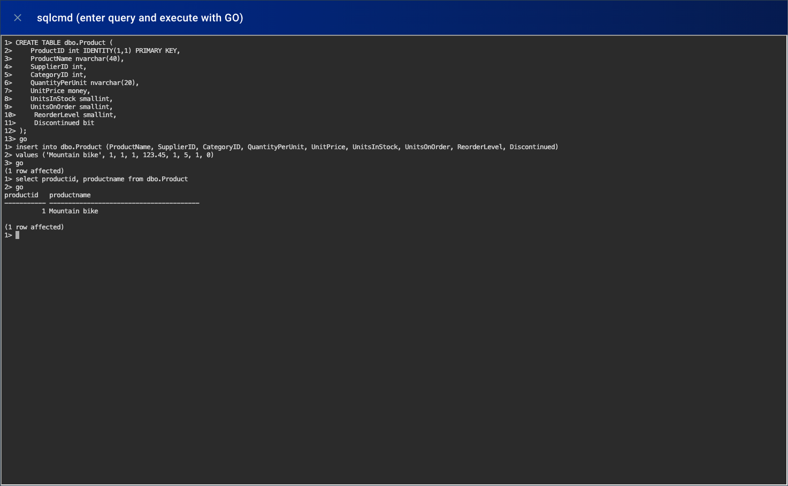
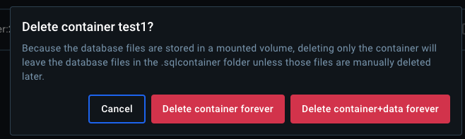

# Local SQL

 &nbsp;


This repository contains the code for the Docker [SQL extension](https://open.docker.com/extensions/marketplace?extensionId=drewsk/docker-sql-extension&tag=latest), which enables you to create and manage SQL containers in Docker Desktop.

### 🔌 Install via Docker Desktop https://open.docker.com/extensions/marketplace?extensionId=drewsk/docker-sql-extension&tag=0.2.0

## Get started

After installing the extension, you can create a new SQL container by clicking on the "SQL containers" extension tab in Docker Desktop. Select the version of SQL Server you want to use, enter a container name, SQL port, and generate a password before clicking the plus button to create the container.



Once a container is created, you can start, stop, and delete it using the buttons in the extension tab. Under the container details you can create databases and connect to the container - either directly in the extension with the embedded sqlcmd tool or by using your preferred SQL client. For convenience the connection string is displayed in the extension tab and a button for launching Azure Data Studio is provided.



_When launching Azure Data Studio from the extension the sa password is automatically copied into the clipboard, paste it in the connection dialog when Azure Data Studio opens._

> [!TIP]
> A full help guide is available in the extension tab under the question mark icon.

### Embedded sqlcmd

The extension includes the go-sqlcmd CLI tool installed on the service container, which allows you to run SQL queries directly from the extension without installing any additional tools on your machine. To launch sqlcmd, click on the "Connect with sqlcmd" icon next to the database name. An interactive terminal will launch and automatically login to your SQL database.





### Persistent storage

The containers created by the SQL extension utilize persistent storage for `/var/opt/mssql`, including the database files. This means that the data in the container will persist even if the container is stopped or deleted and you have an easier pathway to interacting with database backups. Each container's volume is named after the container name (+timestamp) and is stored in the `.sqlcontainters` directory in your home folder.



## Support

This extension is a hobby project and is not officially supported by Microsoft or Docker. If you encounter any issues, please open an issue in this repository.

## Contributing

The extension is licensed under the [MIT license](./LICENSE). Feel free to open issues and pull requests to improve the extension. I'm interested in investment in:

- cross compatibility as a Podman desktop extension
- selected options for container creation (eg Express vs Developer SKU)
- deploying dacpac files to the container
- your good ideas

This extension code is composed of:

- A [frontend](./ui) app in React that dictates the display in Docker Desktop.
- A [backend](./backend) container that runs an API in Go. It exposes the endpoints which interact with the docker daemon and with SQL endpoints.
- A [host](./host) folder that contains executables the extension needs to create and delete SQL containers.
- A [Dockerfile](./Dockerfile) that builds the extension.

## Local development

To build the extension, use:

```shell
  docker build -t drewsk/docker-sql-extension:latest --no-cache .
```

To install the extension, use :

```shell
  docker extension install drewsk/docker-sql-extension:latest
```

> If you want to automate this command, use the `-f` or `--force` flag to accept the warning message.

To preview the extension in Docker Desktop, open Docker Dashboard once the installation is complete. The left-hand menu displays a new tab with the name of your extension. You can also use `docker extension ls` to see that the extension has been installed successfully.

To update the extension after making changes, use:

```shell
  docker extension update drewsk/docker-sql-extension:latest
```

### Frontend development

During the development of the frontend part, it's helpful to use hot reloading to test your changes without rebuilding the entire extension. To do this, you can configure Docker Desktop to load your UI from a development server.

To start the local development server, run:

```shell
  cd ui
  npm install
  npm run dev
```

You can now tell Docker Desktop to use this as the frontend source. In another terminal run:

```shell
  docker extension dev ui-source drewsk/docker-sql-extension:latest http://localhost:5173
```

In order to open the Chrome Dev Tools for the extension when you click on the extension tab, run:

```shell
  docker extension dev debug drewsk/docker-sql-extension:latest
```

Each subsequent click on the extension tab will also open Chrome Dev Tools. To stop this behaviour, run:

```shell
  docker extension dev reset drewsk/docker-sql-extension:latest
```

### Backend development

This extension includes an API in Go that is deployed as a backend container when the extension is installed. This backend container is responsible for handling requests from the frontend and hosts go-sqlcmd for on-demand CLI access to SQL containers.

Whenever you make changes in the [backend](./backend) source code, you will need to compile them and re-deploy a new version of your backend container.
Use the `docker extension update` command to remove and re-install the extension automatically:

```shell
docker extension update drewsk/docker-sql-extension:latest
```

> [!TIP]
> Extension containers are hidden from the Docker Dashboard by default. You can change this in Settings > Extensions > Show Docker Extensions system containers.

## Notices

The extension is licensed under the [MIT license](./LICENSE).

The SQL containers extension is designed for local development and testing purposes. The extension does not support production workloads or high availability scenarios. SQL Server instances created by this extension are configured with the default settings and the SQL Server Express license.

This extension collects anonymous usage data to help improve the extension. The data collected includes the number of containers created and instances of other actions taken with the extension. The data is used for improving the extension. To disable data collection, obtain the extension source from GitHub and build the extension locally with the Application Insights connection string removed from App.tsx.
